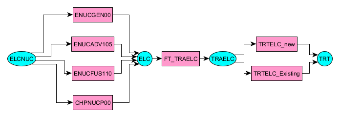
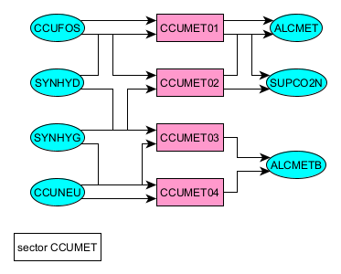
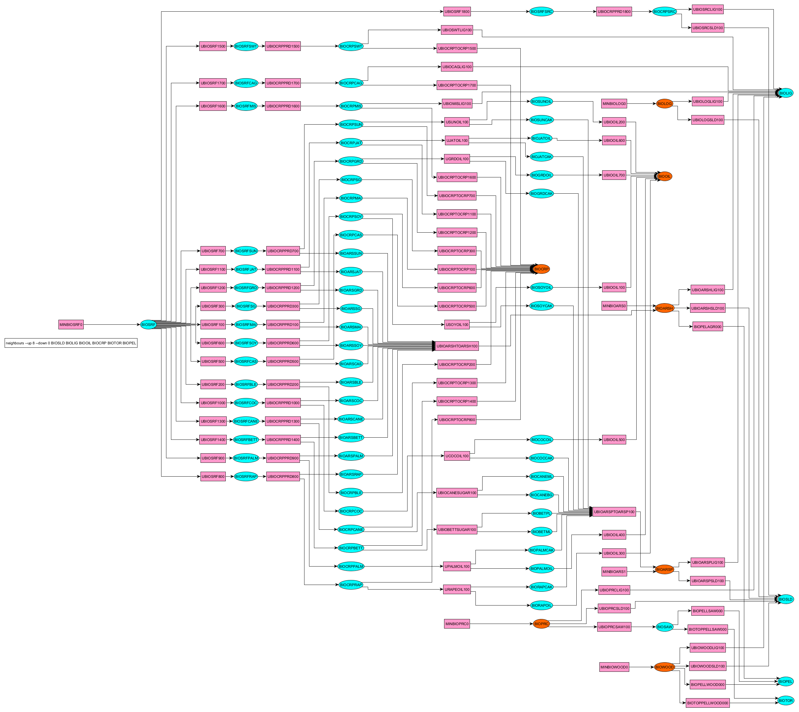

# VDT files postprocessing with RES-Explorer (RESx)

VDT files are VEDA (VErsatile Data Analyst) Topology files generated by [VEDA-TIMES models](https://iea-etsap.org/docs/Documentation_for_the_TIMES_Model-Part-IV.pdf) containing the [Reference Energy System (RES)](https://iea-etsap.org/index.php/etsap-tools/model-generators/times) of the model. A VDT file is a scenario-specific RES denoting processes' inputs and outputs for each region of the model.

Processes and commodities in a VEDA-TIMES model are organized in a directed bi-colored graph interpreted as the RES of the model, in general too big to be displayed.

RESx allows to request different extractions from the whole RES graph, resulting in sub-graphs sufficiently small to be drawn. 

Extractions are put in a graphml formatted local file GX.xml, which can be processed by the [yEd](https://www.yworks.com/products/yed) application. yEd offers many nice layouts for graphs.

Note that the local file GX.xml always contains the last extraction. It is the user responsability to possibly archive it.

## RESx commands

Usage: resx [OPTIONS] COMMAND [ARGS]...

 - resx --help
 - resx --version

## Sub commands
### Convert a vdt file (VDT) to a networkx graph, output to xml file:  command init
 - resx init VDT 
 
Output in file 'current-RES.xml'
Resulting graph can be interpreted as a RES, usually too big to be displayed.

### Explore graph sub commands 
 - resx parents <node>
 - resx children <node>
 - resx path <source_node> <target_node>
 - resx neighbours --up=up_depth --down=down_depth <node_list>
 - resx sector <reg_expr nodelist>
 
Extract sub-graphs, sufficiently small to be displayed

### Examples

<figure>
      
    <figcaption  class="figure-caption text-center">resx path ELCNUC TRT</figcaption>
</figure>

<figure>
      
    <figcaption  class="figure-caption text-center">resx sector CCUMET</figcaption>
</figure>

<figure>
      
    <figcaption  class="figure-caption text-center">neighbours --up 8 --down 0 BIOSLD BIOLIG BIOOIL BIOCRP BIOTOR BIOPEL</figcaption>
</figure>