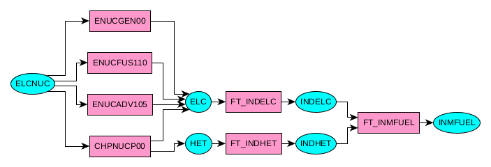
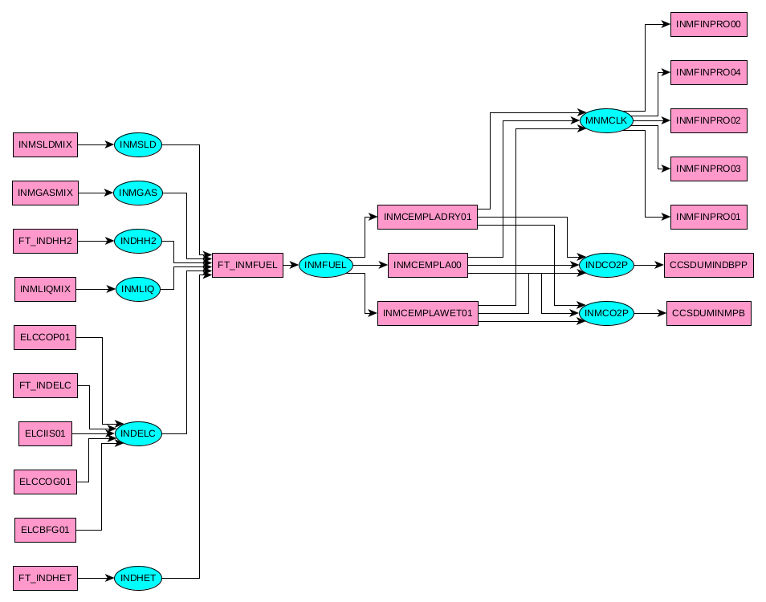

# VDT files postprocessing: vdt2xml, gshow

The VDT file is a VEDA Topology File. VEDA (VErsatile Data Analyst) is a powerful yet user friendly set of tools geared to facilitate the creation, maintenance, browsing, and modification of the large data bases required by complex mathematical and economic models [ref](https://www.filesuffix.com/fr/extension/vdt). 

## Convert vdt file to networkx graph, output to xml file:  command vdt2xml
 - vdt2xml  vdt_file  xml_file
 
Resulting graph can be interpreted as a RES, in general too big to be displayed.

## Explore graph: command gshow+verb
 - gshow path source_node target_node
 - gshow neighbours node up_depth down_depth
 
Extract sub-graphs, sufficiently small to be displayed

## Examples

<figure>   
    <figcaption  class="figure-caption text-center">gshow path ELCNUC INMFUEL</figcaption>
   
</figure>
<figure>   
    <figcaption  class="figure-caption text-center">gshow neighbours INMFUEL 3 3</figcaption>
   
</figure>
